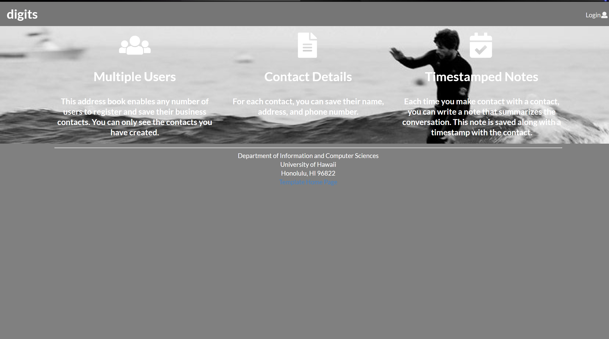
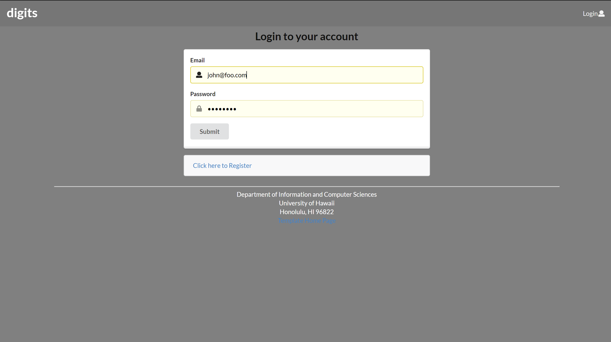
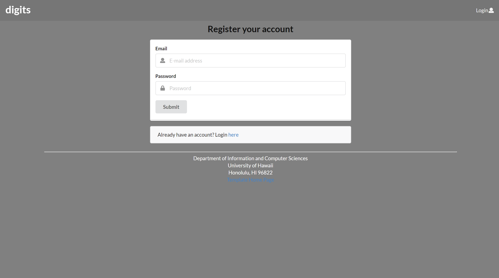
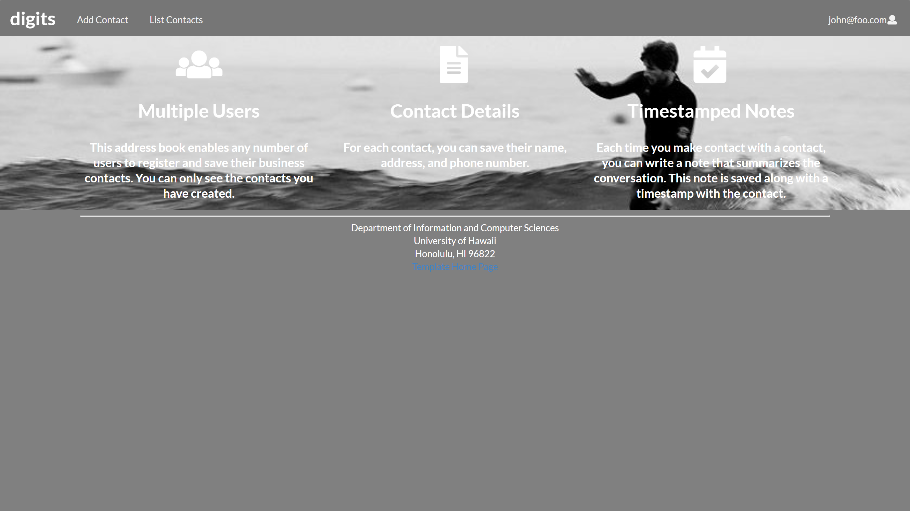
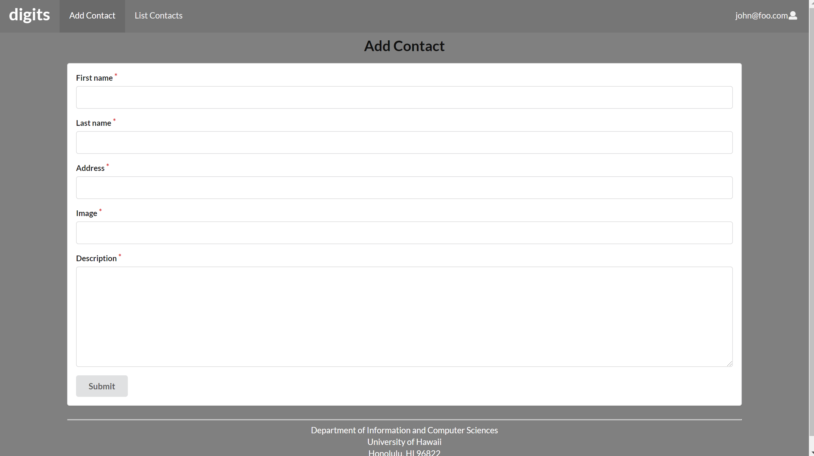
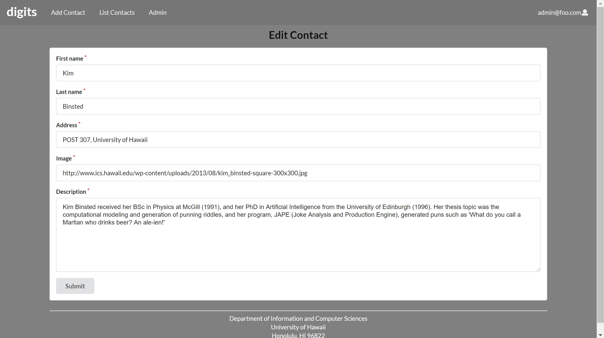
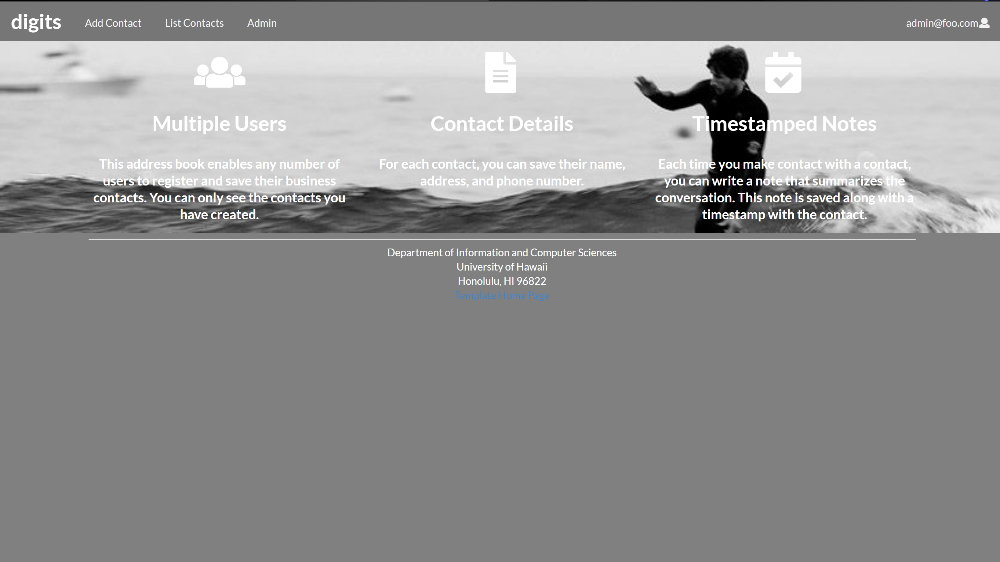
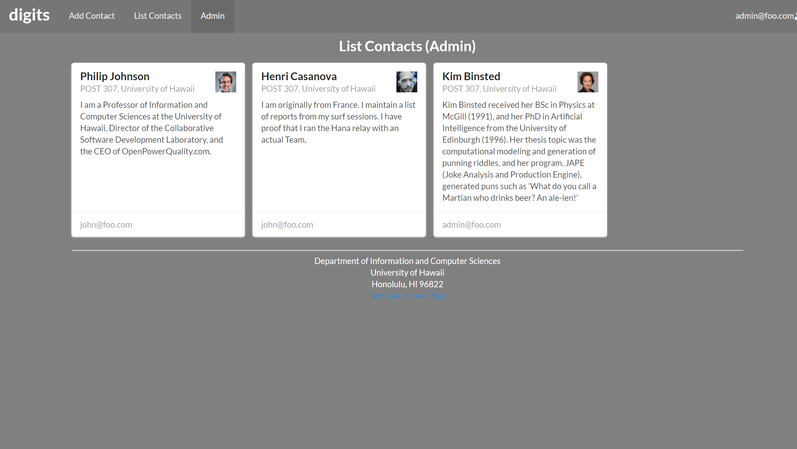

## Installation
To view this application, you must first [install meteor](https://www.meteor.com/install).  Next, go to your Command Prompt (windows) and cd into your /app directory.  
Then type $meteor npm install.  Once that is finished, type $meteor npm run start.  Once this is done running, your application should run on the website http://localhost:3000.

## Walkthrough
The first page is the Landing page as shown in the picture above.  This is an introductory page that tells you what you need to know about the application you are signing up for.  
Should you choose to create an account or login, it will then take you to the home page that looks exactly like the landing page except there will now be option in the top menu.  
The first tab is "Add Contact".  This will allow you to add a person's information into the database.  To view this contact, you can click on the "List Contacts" tab.  
  You can also place a side note attached to the contact in the bottom portion of the contact card.  It will show you your note along with a time stamp.

#### Login page

Clicking on the Login link, then on the Sign In menu item displays this page:

#### Register page

Alternatively, clicking on the Login link, then on the Sign Up menu item displays this page:

#### Landing (after Login) page, non-Admin user

Once you log in (either to an existing account or by creating a new one), the navbar changes as follows:

You can now add new Stuff documents, and list the Stuff you have created. Note you cannot see any Stuff created by other users.

#### Add Stuff page

After logging in, here is the page that allows you to add new Stuff:

#### List Stuff page

After logging in, here is the page that allows you to list all the Stuff you have created:

You click the "Edit" link to go to the Edit Stuff page, shown next.

#### Edit Stuff page

If you accidentally see you have made a mistake, then you can press the edit option on the contact card. This will take you to the page shown below where you can resubmit your changes.

#### Landing (after Login), Admin user

If you want to add an extra "admin" user, you can do so in the settings.json file. This user, after logging in, gets a special entry in the navbar:

#### Admin page (list all users stuff)

The admin page will have the same exact properties, but it will have one extra tab called "admin".  This tab will show all contacts in the system and will show who the owner is as shown:

Note that non-admin users cannot get to this page, even if they type in the URL by hand.

### Collections

The application implements a single Collection called "Contact". Each Contact document has the following fields: firstName, lastName, address, image, and description (admin: owner).

The Contact collection is defined in [imports/api/contact/Contacts.js](https://github.com/auusui/digits/blob/master/app/imports/api/contact/Contacts.js).

The Contact collection is initialized in [imports/startup/server/Publications.js](https://github.com/auusui/digits/blob/master/app/imports/startup/server/Publications.js).

